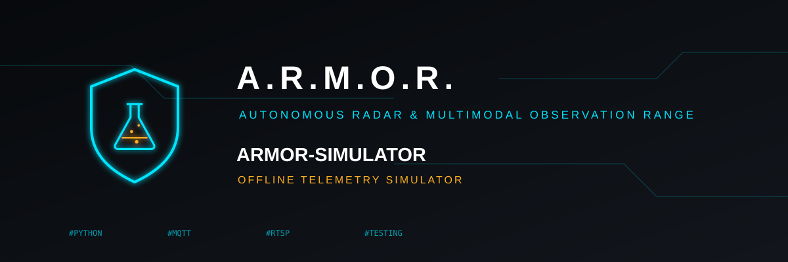

<p align="center">
  
</p>

# 🧪 ARMOR-SIMULATOR

<p align="center">
  <a href="README.md">🇺🇸 English</a> |
  <a href="README_spa.md">🇪🇸 Español</a> |
  <a href="README_fra.md">🇫🇷 Français</a> |
  🇮🇹 <b>Italiano</b> |
  <a href="README_deu.md">🇩🇪 Deutsch</a> |
  <a href="README_zho.md">🇨🇳 简体中文</a> |
  <a href="README_jpn.md">🇯🇵 日本語</a>
</p>

### Simulatore di telemetria offline con guasti ripetibili

<p align="center">
  
  
  
  
</p>

---

**Controllo di onestà - cosa funziona oggi:** Gli scenari, i guasti, l'invio a un server e i 24 test sono reali. La geometria è **illustrativa**, non un modello del vero radar LD2450, e nulla è stato confrontato con hardware reale.

---

## 🎯 Panoramica

* **Scenari:** `patrol`, `crossing`, `two-intruders` ed `empty`, su una geometria d'angolo a tre sensori, con un ciclo di luce giorno/notte o una notte fissa.
* **Guasti ripetibili:** un nodo muto, messaggi fuori ordine o duplicati, un nodo instabile e messaggi volutamente non validi (lux oltre il limite, campo sconosciuto, troppe tracce) per i test negativi.
* **Deterministico:** lo stesso seme stampa sempre le stesse righe; non viene inviato nulla senza `--server-url` e `--ingest-token`.
* **Verificato contro il contratto:** `--validate` fa passare ogni messaggio per ARMOR-COMMON prima di emetterlo.
* **Invio prudente:** si accetta solo un'origine http(s) semplice; un 4xx ferma l'esecuzione, un 5xx o un errore di rete viene ritentato.

## 📂 Struttura del repository

```text
ARMOR-SIMULATOR/
├── src/armor_simulator/   scenarios, faults, publisher, cli
├── tests/                 24 tests, including a local HTTP server
└── docs/USAGE.md
```

## 🛠️ Ambiente di sviluppo

```powershell
$env:PYTHONPATH="src"
python -m armor_simulator --count 20 --scenario crossing --seed 1 --validate
python -m unittest discover -s tests   # 24 tests
```

Tutte le opzioni, gli scenari e i guasti: [uso](docs/USAGE.md).

## 🔗 Progetti correlati

**A.R.M.O.R.** (Autonomous Radar & Multimodal Observation Range) è un sistema di sicurezza perimetrale fatto di repository indipendenti. Ognuno ha la propria versione, i propri test e il proprio README; ecco la famiglia:

* **[ARMOR-COMMON](../ARMOR-COMMON)** - Contratti dei messaggi, validatori, vettori di conformità e tipi generati
* **[ARMOR-RADAR](../ARMOR-RADAR)** - Firmware del nodo di campo per ESP32-S3 con tre radar e un proprio pannello web
* **[ARMOR-SOLAR](../ARMOR-SOLAR)** - Protocolli di inverter e batterie solari e messaggi di un nodo gateway
* **[ARMOR-SERVER](../ARMOR-SERVER)** - Coordinatore centrale: telemetria, allarmi, dispositivi, letture solari e telecamere
* **[ARMOR-STUDIO](../ARMOR-STUDIO)** - Console web: telecamere, radar, allarmi, energia solare e progettista del sito 2D/3D
* **[ARMOR-ANDROID-CONTROL](../ARMOR-ANDROID-CONTROL)** - Client Android dell'operatore con radar 2D/3D in tempo reale
* **[ARMOR-SERVER-AI](../ARMOR-SERVER-AI)** - Politica di inferenza visiva che spiega le sue decisioni e non agisce mai
* **[ARMOR-VOICE-AI](../ARMOR-VOICE-AI)** - Intenti vocali offline con una conferma impossibile da falsificare
* **[ARMOR-HARDWARE](../ARMOR-HARDWARE)** - Contenitori, elettronica e matrice di accettazione da banco
* **[ARMOR-DEVOPS](../ARMOR-DEVOPS)** - Distribuzione, banco di prova CM5, backup e TLS
* **ARMOR-SIMULATOR** (questo repository) - Simulatore di telemetria offline con guasti ripetibili
* **[ARMOR-DOCS](../ARMOR-DOCS)** - Architettura, base di sicurezza e matrice delle capacità

## 📚 Documentazione e comunità

Dove leggere di più:

* [Matrice delle capacità: cosa è provato e cosa no](../ARMOR-DOCS/docs/CAPABILITY_MATRIX.md)
* [Catalogo dei progetti: versioni e dipendenze tra i repository](../ARMOR-DOCS/docs/PROJECT_CATALOG.md)
* [Cronologia delle modifiche di questo repository](CHANGELOG.md)
* [Licenza (GPL-3.0-or-later)](LICENSE)
* Domande, idee e segnalazioni: electrohobby3d@gmail.com

## 👤 AUTORE

**JuanenRac (Electro Hobby 3D)** · electrohobby3d@gmail.com

## 📜 LICENZA

GPL-3.0-or-later - vedi [LICENSE](LICENSE).
